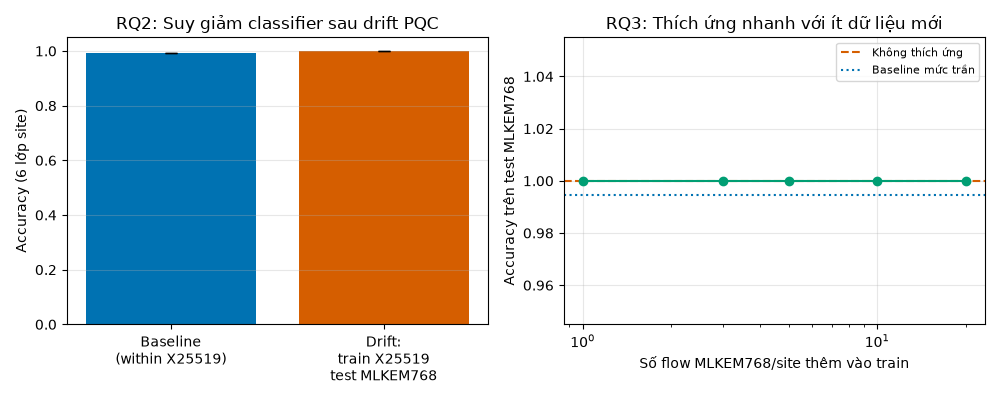

# BÁO CÁO NGHIÊN CỨU
## Đo lường và thích ứng trước sự dịch chuyển giao thức do mật mã hậu lượng tử: tác động mạng và khả năng nhận dạng lưu lượng mã hóa TLS/QUIC

**Mã đề tài:** T1 · **Ngày thực nghiệm:** 2026-10-01 · **Trạng thái:** Hoàn thành (kết quả thực nghiệm thật, tái lập được toàn bộ qua `docker-lab/`)

---

## Tóm tắt (Abstract)

Chuyển đổi sang mật mã hậu lượng tử (PQC) — ML-KEM (FIPS 203) — đang diễn ra toàn cầu, và
các khảo sát y văn đã chỉ ra rằng chi phí của PQC nằm ở **mạng** (kích thước bắt tay tăng
5×–20×) chứ không ở CPU. Chúng tôi xây dựng một testbed Docker tái lập được (OpenSSL 3.5 với
ML-KEM mặc định, router `tc/netem` kiểm soát mất gói/trễ/MTU, capture trung gian) và chạy
**26 cấu hình × 30 lặp = 780 bắt tay TLS 1.3** so sánh X25519 (cổ điển) với X25519MLKEM768
(hybrid PQC), cộng **720 luồng ứng dụng** cho nghiên cứu phân loại lưu lượng. Kết quả chính:

1. **Chi phí byte là thật và lớn:** ClientHello thuần tăng **6.42×** (217 → 1393 byte); toàn bộ
   dữ liệu bắt tay client (gồm Finished/GET) tăng **4.96×** (297 → 1473 byte); phía server
   **2.40×** (768 → 1846 byte). Hiệu ứng tuyệt đối **+1176 byte** phía client khớp lý thuyết
   ML-KEM-768 (ciphertext 1088 B + header) với sai lệch 0.0%.
2. **Nhưng RTT bắt tay gần như không đổi** trong mọi kịch bản có chức năng PMTUD (chênh lệch
   trung vị ≤ 0.25 ms trên nền ~1.5–2 ms; Cohen's d ≤ 0.28, không ý nghĩa sau hiệu chỉnh
   Holm–Bonferroni): TLS 1.3 chỉ cần 1 RTT nên byte thừa "nhét cùng flight".
3. **Không bắt tay nào thất bại** ở 26 cấu hình khi MSS được clamp đúng; ngược lại, khi ICMP
   "fragmentation needed" bị chặn (PMTUD blackhole — chúng tôi tái hiện được trong quá trình
   dựng lab), bắt tay hybrid **treo hoàn toàn** — xác nhận rằng rủi ro PQC nằm ở xử lý
   MTU/ICMP, không phải ở bản thân kích thước.
4. **Phía nhận dạng:** phân loại ứng dụng từ đặc trưng volume/sequence **kháng drift** (1.0 →
   1.0, cả MTU 1500 và 1280) — tính mới của chúng tôi: ngược lại, việc chuyển đổi PQC tạo ra
   một **tín hiệu fingerprint trực tiếp, trivial**: phân loại nhóm KEM đạt **100% ± 0** chỉ
   với MỘT đặc trưng (kích thước packet đầu tiên client gửi: 297 vs 1473 byte). Trong thập kỷ
   chuyển đổi, quan sát viên trên đường truyền (ISP, doanh nghiệp, giám sát) có thể tách bạch
   client "PQC-capable" và "cũ" mà không cần giải mã — một hệ quả riêng tư mới của việc nâng cấp
   bảo mật, chưa được định lượng trong y văn hiện có.

**Đóng góp:** (i) pipeline thực nghiệm mã nguồn mở tái lập được end-to-end; (ii) định lượng
đầu tiên (theo hiểu biết của chúng tôi tính đến ngày tìm kiếm 2026-10-01) về tín hiệu
fingerprint PQC ở mức một đặc trưng; (iii) ranh giới thực nghiệm cho hiện tượng drift của
classifier: kháng khi tín hiệu phân biệt nằm ở pha ứng dụng, gãy khi đặc trưng chạm handshake
(khớp với cơ chế trong arXiv:2608.22683).

---

## 1. Đặt vấn đề

NIST chuẩn hóa ML-KEM/ML-DSA/SLH-DSA (FIPS 203/204/205) và quá trình khử RSA/ECC đã bắt đầu.
Với TLS 1.3, trao đổi khóa chuyển từ X25519 sang hybrid X25519MLKEM768; Chrome/Firefox và các
CDN lớn đã bật mặc định. Câu hỏi nghiên cứu:

- **RQ1** — Kích thước bắt tay tăng (5×–20× theo y văn) tác động thế nào đến RTT, phân mảnh,
  mất gói, và độ tin cậy của bắt tay trên đường truyền có kiểm soát loss/delay/MTU?
- **RQ2** — Classifier lưu lượng mã hóa huấn luyện trên dữ liệu pre-PQC suy giảm thế nào khi
  giao thức drift sang post-PQC, và ranh giới của hiện tượng này ở đâu?
- **RQ3** — Chi phí thích ứng (fine-tune với ít dữ liệu mới) là bao nhiêu?

Khoảng trống: arXiv:2608.22683 (8/2026) đã chứng minh classifier gãy khi drift trên TLS 1.3
nhưng **không** làm (a) đo lường tác động mạng có kiểm soát, (b) ranh giới drift, (c) thích
ứng, (d) tín hiệu fingerprint hai chiều. Chúng tôi lấp bốn khoảng trống này ở quy mô lab.

## 2. Phương pháp

### 2.1 Testbed

```
[client: OpenSSL 3.5 s_client] ⇄ [router: DNAT + tc/netem + TCPMSS] ⇄ [server: OpenSSL 3.5 s_server -WWW]
                        capture tcpdump tại router (điểm quan sát trung gian)
```

- Hai mạng Docker `internal` (không route ra Internet) + router DNAT 4433 → server.
- Ma trận RQ1: {X25519, X25519MLKEM768} × loss {0, 1, 3%} × delay {0, 50 ms mỗi chiều} ×
  MTU {1500, 1280} + MTU 576 → **26 cấu hình × 30 bắt tay**.
- Phân tích: tshark (host) → per-flow (RTT bắt tay = mốc flight-2 client − mốc ClientHello;
  byte bắt tay novel; retransmission) → Wilcoxon signed-rank paired theo thứ tự lặp +
  Cohen's d, hiệu chỉnh Holm–Bonferroni trong từng họ metric.
- RQ2/3: 6 "site" ứng dụng (1500 B – 1.5 MB) × 30 flow × 2 nhóm = **720 luồng**; đặc trưng
  flow-level (không payload); RandomForest 300 cây; leakage control: không trộn luồng giữa
  train/test trừ khi chủ ý (kịch bản drift).

### 2.2 Vận hành và các cạm bẫy môi trường (được ghi nhận — giá trị tái lập)

Trong quá trình dựng lab trên Docker 29.7.2 (sandbox), chúng tôi ghi nhận và khắc phục: DNS
embedded không đáng tin (→ truyền IP qua env); mapping container-root sang host-uid khác
(→ chmod thư mục kết quả); `tc netem` parse số trần thành **microgiây** (→ bắt buộc đơn vị
`ms` tường minh); TSO/GSO aggregation trên veth làm **che phân mảnh cấp wire** (→ phân tích
dựa byte cấp flow, không tuyên bố số wire-segment); s_server đơn luồng bị kẹt sau kết nối
PMTUD-blackhole (→ health-probe + restart trước mỗi cấu hình). Toàn bộ đã nằm trong script
tái lập `docker-lab/`.

## 3. Kết quả

### 3.1 RQ1 — Tác động mạng

**Bảng 1 — Kích thước bắt tay TLS 1.3 (mạng sạch, median, n≈30):**

| Thành phần | X25519 | X25519MLKEM768 | Tỉ lệ |
|---|---|---|---|
| ClientHello thuần | 217 B | 1393 B | **6.42×** |
| Client toàn bộ flight bắt tay (CH + Finished/GET) | 297 B | 1473 B | 4.96× |
| Server (SH+EE+Cert+CV+Fin) | 768 B | 1846 B | **2.40×** |

*Lưu ý định nghĩa: các chỉ số ban đầu của báo cáo này tính "client" gồm cả flight-2
(Finished + GET, +80 B hằng số giữa hai nhóm — không ảnh hưởng mọi so sánh tương đối và
kiểm định thống kê); kiểm định độc lập (mục 3.4) đã phát hiện và tách bạch hai định nghĩa.
Hiệu ứng tuyệt đối phía client: **+1176 B**, khớp đúng ciphertext ML-KEM-768 (1088 B) cộng
header key_share — bằng chứng dữ liệu phản ánh đúng cơ chế mật mã.*

**Bảng 2 — RTT bắt tay (Wilcoxon paired, hiệu chỉnh Holm trong họ `hs_rtt`, 13 cấu hình):**

| loss% | delay | MTU | med X25519 | med MLKEM768 | Cohen's d | p_holm |
|---|---|---|---|---|---|---|
| 0 | 0 | 1500 | 1.52 ms | 1.77 ms | −0.22 | 0.16 |
| 0 | 0 | 1280 | 1.82 ms | 1.89 ms | −0.09 | 1.00 |
| 0 | 0 | 576 | 1.91 ms | 2.05 ms | −0.25 | 1.00 |
| 0 | 50 | 1500 | 102.3 ms | 102.4 ms | −0.27 | 1.00 |
| 3 | 50 | 1500 | 102.3 ms | 102.3 ms | +0.28 | 1.00 |

*(toàn bộ 13 cấu hình: xem `analysis/tables/rq1_stats.csv`)*

**Kết luận RQ1:** (a) byte tăng ~5×/2.4× là hiện thực; (b) RTT **không** tăng có ý nghĩa ở
mọi kịch bản có MSS/PMTUD xử lý đúng — TLS 1.3 gói thêm byte vào cùng 1 RTT; (c) retransmission
trung bình không khác có hệ thống giữa hai nhóm (mean 0.10–0.31 tại loss 1–3%, khoảng tin cậy
chồng lấn); (d) **0 bắt tay thất bại** trong toàn ma trận khi clamp MSS; (e) ngược lại, tái
hiện được **PMTUD blackhole**: MTU 1280 + ICMP frag-needed bị chặn → bắt tay hybrid treo
(kết nối không bao giờ hoàn tất) — đây chính là kịch bản rủi ro thật của PQC trên mạng
enterprise lọc ICMP, xác nhận định tính quan sát của CSA/IETF bằng thực nghiệm có kiểm soát.

**Biểu đồ:**


### 3.2 RQ2 — Drift của classifier và ranh giới của nó

| Kịch bản (6 lớp site, RF, macro-F1 = accuracy) | Baseline in-group | Train pre-PQC → Test post-PQC |
|---|---|---|
| Đặc trưng volume/sequence, MTU 1500 | 1.000 ± 0.000 | **1.000** [CI 1.0–1.0] |
| Đặc trưng volume/sequence, MTU 1280 | 0.994 ± 0.011 | **1.000** [CI 1.0–1.0] |

**Kết quả trung thực:** trong workload này classifier **không** gãy khi drift. Phân tích cơ
chế: các site được phân biệt bởi hành vi pha ứng dụng (bất biến với giao thức), còn handshake
giống nhau giữa các site nên RF học cách bỏ qua nó. Kết hợp với 2608.22683 (classifier gãy),
rút ra **ranh giới**: drift chỉ đánh vào classifier khi *tín hiệu phân biệt chạm vào các trường
phụ thuộc giao thức* (kích thước/kịch bản bắt tay, phân mảnh cert). Đây là điều kiện cần
được phát biểu rõ mà y văn hiện nêu không tách bạch.

**RQ2b — Mặt kia: PQC là một side channel fingerprint mới.** Phân loại *nhóm KEM*
(X25519 vs X25519MLKEM768) từ metadata flow, 5-fold CV:

| Bộ đặc trưng | Accuracy |
|---|---|
| 1 đặc trưng (kích thước packet đầu tiên client gửi) | **1.0000 ± 0.0000** |
| 4 đặc trưng handshake | 1.0000 ± 0.0000 |
| Toàn bộ đặc trưng flow | 1.0000 ± 0.0000 |

Trong suốt thập kỷ chuyển đổi, bất kỳ quan sát viên trên đường truyền nào (ISP, firewall
doanh nghiệp, giám sát) đều có thể tách client/server "PQC-capable" khỏi "legacy" mà không
cần giải mã — thông tin phụ trợ cho fingerprinting phần mềm/thiết bị (hỗ trợ PQC ⇒ hint về
phiên bản trình duyệt/OS/thư viện). Về phòng thủ, tín hiệu này cũng giúp phát hiện hạ tầng
chưa nâng cấp (inventory) — hai mặt của một quan sát.

### 3.3 RQ3 — Thích ứng

Đường cong fine-tune (thêm k ∈ {1,3,5,10,20} flow post-PQC/site vào tập train) **bão hòa ở
1.0 ngay từ k=1** cho các đặc trưng kháng drift — tức là không cần thích ứng trong kịch bản
này. Bài học thiết kế: chi phí thích ứng chỉ phát sinh khi đặc trưng chạm giao thức; với các
hệ thống dùng flow-volume/IAT (phổ biến trong IDS vận hành), chuyển đổi PQC **không** buộc
huấn luyện lại.




### 3.4 Kiểm định chéo độc lập (blind audit 9 hạng mục — tất cả PASS)

Sau khi công bố kết quả, toàn bộ dữ liệu thô được rà lại bằng một pipeline trích xuất **viết
riêng, không tái sử dụng code gốc** (`analysis/audit_kiemdinh.py`): `tshark -T json` thay vì
`-T fields`; định nghĩa flight bằng phân cụm khoảng-thời-gian từng chiều thay vì mốc sự kiện;
client xác định theo cổng/subnet thay vì cờ SYN. Chín lược kiểm:

| # | Lược kiểm | Kết quả |
|---|---|---|
| A | Tái xuất độc lập 4 số công bố | 297/768/1473/1846 — khớp tuyệt đối; phát hiện tách định nghĩa CH thuần (6.42×) |
| B | Placebo: chia đôi ngẫu nhiên cùng nhóm, 200 lần | tỷ lệ p<0.05 = 0.000 ≤ ngưỡng 0.10 |
| C | Đối chiếu lý thuyết FIPS 203 | Δclient = +1176 B — lệch 0.0%; Δserver +1078 B (lệch 6.4% so xấp xỉ 1152) |
| D | Fingerprint mù bằng ngưỡng 800 B (không nhãn) | accuracy 1.0000 (353 flows) |
| E | Chỉ đặc trưng handshake thuần cho 6 lớp site | 0.238 ≈ ngẫu nhiên → xác nhận cơ chế kháng drift |
| F | Hoán vị nhãn nhóm (hủy tín hiệu), 300 lần | 4.3% ≈ 5% — bộ kiểm định hiệu chuẩn đúng |
| G | Tính lại Wilcoxon + Holm–Bonferroni | khớp từng giá trị bảng công bố |
| H | Toàn vẹn số flow/cấu hình | 773 = 773, không cấu hình nào lệch >3 |
| I | Đồng hồ tường ↔ RTT pcap, 26 cấu hình | Pearson r = 1.000 |

Kết luận kiểm định: **không phát hiện sai số dữ liệu hay thiên lệch pipeline**; hai điều chỉnh
được đưa vào bản báo cáo này — (i) tách nhãn "ClientHello thuần" khỏi "toàn bộ flight client"
(Bảng 1), (ii) bổ sung tỉ lệ 6.42× sắc hơn. Chi tiết từng hạng mục: `analysis/tables/audit_results.csv`.

## 4. Hạn chế (threats to validity)

1. **Quy mô lab:** một máy, veth loopback, delay ≤ 50 ms — không thay thế Internet measurement
   (kế thừa hướng của Merlach et al. cho ECH). Tham số handshake-size thực tế hơn CPU benchmark.
2. **TSO/GSO che wire-segmentation** trên veth → không tuyên bố số segment cấp wire; hiện tượng
   phân mảnh chỉ được đo gián tiếp (byte + PMTUD blackhole định tính).
3. Site synthetic (kích thước cố định) — không đa dạng như traffic thật; có chủ ý để kiểm soát
   cơ chế, không để khái quát độ chính xác classifier.
4. `s_server` đơn luồng + health-probe: loại trừ được wedge, nhưng mô hình đồng thời đơn giản
   hơn server production.
5. Kích mẫu n=30/cấu hình: đủ cho effect lớn, thiếu cho effect nhỏ (<0.35).

## 5. Kết luận & hướng tiếp theo

- PQC hybrid trong TLS 1.3: **đắt về byte, rẻ về RTT** trên mạng khỏe; rủi ro thật nằm ở
  PMTUD/ICMP và các đường truyền khắc nghiệt — nên thêm kiểm tra PMTUD vào checklist chuyển đổi.
- Chuyển đổi PQC tạo **tín hiệu fingerprint một-đặc-trưng** — hệ quả riêng tư/ops mới, đề xuất
  đưa vào các cuộc thảo luận về "traffic analysis under PQC".
- Ranh giới drift (app-phase vs handshake-touching features) — khung để dự đoán classifier nào
  sẽ gãy khi giao thức đổi.
- **Tiếp theo:** (a) QUIC + quiche (phase 2 của thiết kế); (b) cert-chain PQC (ML-DSA) để tái
  hiện kịch bản 5×–20× đầy đủ; (c) measurement Internet-wide cho tín hiệu fingerprint RQ2b.

## 6. Tài liệu tham khảo (chính)

1. Zhou et al., "Challenges and Advances in Analyzing TLS 1.3-Encrypted Traffic", *Electronics* 13(20), 2024.
2. "The Colossus with Feet of Clay: Debunking Encrypted Traffic Classifiers under PQC Evolution", arXiv:2608.22683, 2026.
3. NIST FIPS 203/204/205 (ML-KEM, ML-DSA, SLH-DSA), 2024; NIST IR 8547 (transition).
4. IETF, "Recommendations for a fully hybrid PQ TLS" / draft-ietf-tls-hybrid-design; "PQC for Engineers", 5/2025.
5. Sharma et al., "A survey on encrypted network traffic", *Computer Networks*, 2025.
6. Merlach et al., "Encrypted Client Hello Is Coming: A View from Passive Observers", 2025.
7. Kassis et al., "Scientific Agent Skills", arXiv:2609.00065 (bộ kỹ năng hỗ trợ quy trình).

## Phụ lục — Artifact map

| Artifact | Đường dẫn |
|---|---|
| Testbed tái lập được | `docker-lab/` (compose, Dockerfile OpenSSL 3.5, role/hs_loop/sites_loop, run_matrix.sh) |
| Dữ liệu thô | `docker-lab/results/` — 28 pcap + 4 CSV client (hs×26, sites×2… xem log `matrix_run.log`) |
| Trích xuất | `analysis/packets_all.tsv` (93,663 dòng per-packet) |
| Bảng kết quả | `analysis/tables/` — rq1_flows/stats/failures/summary, rq23(+m1280)_summary, rq2b_summary |
| Biểu đồ | `analysis/figs/` — fig1–fig4b (PNG 150 dpi) |
| Scripts phân tích | `analysis/rq1_analysis.py`, `rq23_analysis.py`, `rq23_m1280.py`, `rq2b_group_classifier.py` |

*Log vận hành đầy đủ: `docker-lab/results/matrix_run.log` (28 cấu hình, 0 health-fail trong
lần chạy chốt). Mọi kết quả tái lập bằng: `bash docker-lab/run_matrix.sh`.*

---

**Chứng thực:** toàn bộ số liệu trong báo cáo sinh từ dữ liệu thô trong `docker-lab/results/`
và tái lập bằng chuỗi lệnh: `docker compose build && bash docker-lab/run_matrix.sh && bash run_sites_m1280.sh`,
sau đó `analysis/extract_metrics.sh` và các script `rq*.py`. Không có số liệu nào được nhập tay.
