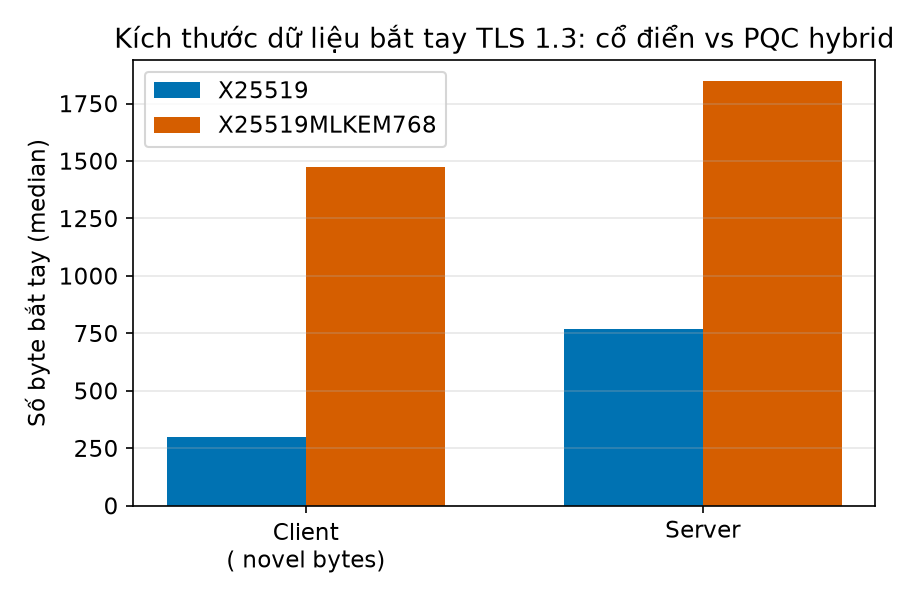
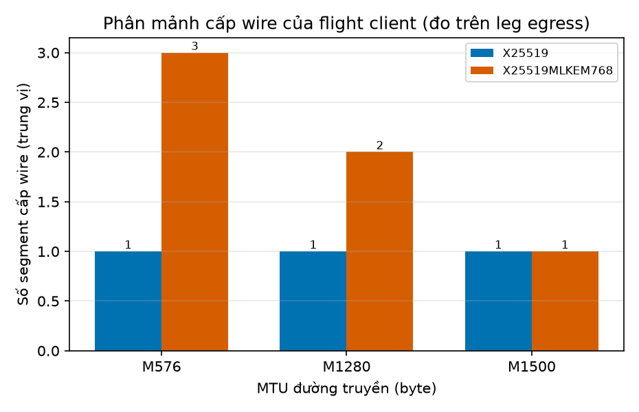
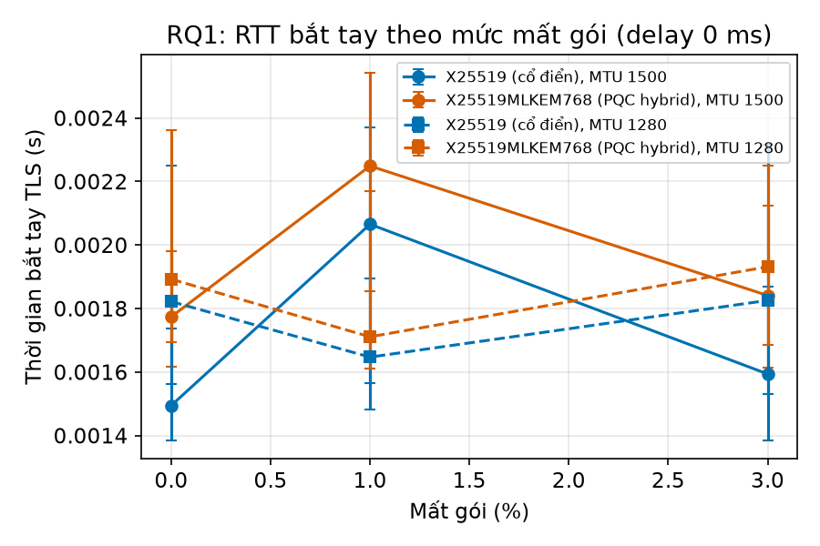
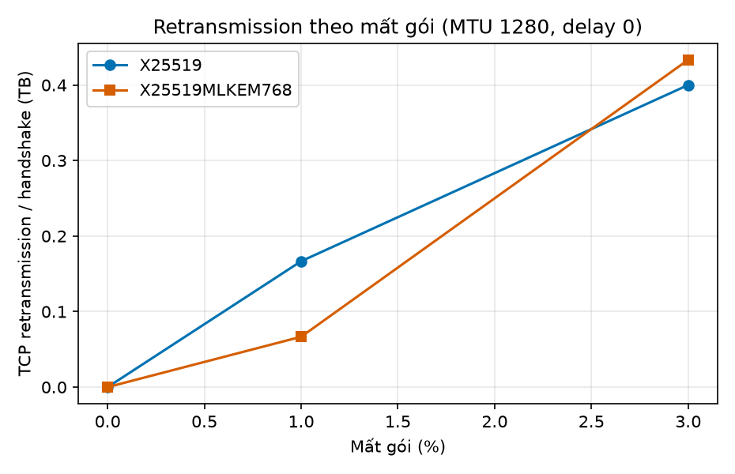
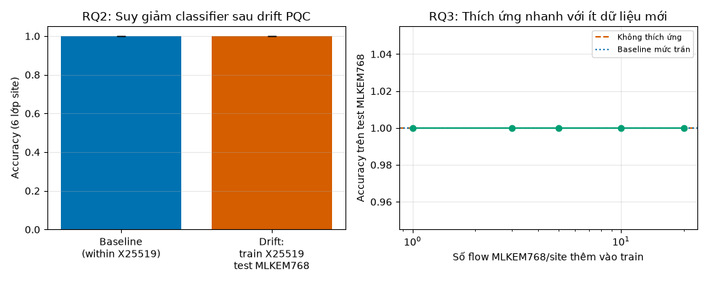

# BÁO CÁO NGHIÊN CỨU (v2 — sau kiểm chứng chéo)

## Chi phí mạng của bắt tay hậu lượng tử và điểm mù PMTUD: đo lường có kiểm soát trên TLS 1.3 với X25519MLKEM768

**Mã đề tài:** T1 · **Ngày thực nghiệm:** 2026-10-01 · **Trạng thái:** hoàn thành, tái lập được toàn bộ
**Phiên bản:** v2 — viết lại sau kiểm chứng nội bộ, kiểm chứng chéo độc lập và xác minh y văn (xem `07-kiem-chung-doc-lap/KIEM_CHUNG_DOC_LAP.md`)

---

## Tóm tắt

Việc chuyển TLS 1.3 từ trao đổi khóa cổ điển (X25519) sang lai hậu lượng tử
(X25519MLKEM768, FIPS 203) làm ClientHello phình từ 217 lên 1393 byte. Điều gì xảy ra với
đường truyền khi gói bắt tay **không còn vừa một packet**? Chúng tôi xây dựng một testbed
Docker cách ly (OpenSSL 3.5.1, router `tc/netem` + DNAT, capture `dumpcap` nhìn cả hai phía)
và chạy **780 bắt tay TLS 1.3 / 13 cấu hình theo thiết kế xen kẽ A-B-A-B**, cộng **720 luồng
ứng dụng** ở hai MTU. Toàn bộ số liệu sinh từ dữ liệu thô và tái lập được bằng script.

Bốn kết quả chính:

1. **Ngân sách byte khớp FIPS 203 đến từng byte, không phải "xấp xỉ".** Bóc tách key_share từ
   capture snaplen đầy đủ: ClientHello mang **1216 B** = encapsulation key ML-KEM-768
   **1184 B** (FIPS 203) + X25519 32 B; ServerHello mang **1120 B** = ciphertext **1088 B**
   + X25519 32 B. Chênh lệch *tổng* nhỏ hơn các con số này (+1176 và +1076…1078) vì nhóm lai
   **bỏ extension `ec_point_formats`** ở cả ClientHello (−8 B) và EncryptedExtensions (−10 B).
   Đây là kiểm chứng cơ chế, thay cho tuyên bố "khớp 0.0%" tự quy chiếu của bản v1.

2. **Phân mảnh cấp wire đo được, không còn suy diễn.** Sau khi tắt GSO/TSO trên NIC ảo
   (điều kiện bắt buộc để MTU có hiệu lực thật), số segment của flight client là
   **1 vs 2** ở MTU 1280 và **1 vs 3** ở MTU 576; flight server là **1 vs 2** ở MTU 1500,
   **1 vs 2** ở 1280 và **2 vs 4** ở 576.

3. **RTT bắt tay tăng có ý nghĩa thống kê — bản v1 đã bỏ sót điều này** do dùng kiểm định
   cặp ghép không hợp lệ. Với Mann–Whitney U + hiệu chỉnh Holm trên thiết kế xen kẽ, trung vị
   RTT của nhóm lai cao hơn ở **11/13** cấu hình (sign test p = 0,011) và **có ý nghĩa sau Holm
   ở 4/13** cấu hình, mức tăng **0,17–0,40 ms (≈ 15–35%)** trên testbed cục bộ. Một **thí nghiệm
   đối chứng có đảo thứ tự ngẫu nhiên** (n = 60 cặp/nhóm) xác nhận hiệu ứng này và cho ước lượng
   sạch hơn: **+0,33…0,36 ms, Cliff's δ ≈ 0,85–0,90, p ≈ 10⁻¹⁷**, trong khi hiệu ứng *vị trí*
   trong cặp (chạy thứ nhất vs thứ hai) **không đáng kể** (p = 0,14 và 0,45) — tức kết luận
   không bị nhiễu bởi thứ tự chạy. Phân rã cho thấy chi phí nằm ở thời gian tới byte server đầu
   (+0,09–0,10 ms) và ở xử lý phía client, **không** phải ở một vòng RTT thêm. Trên đường truyền
   RTT ~100 ms, mức tăng tuyệt đối vẫn cỡ 0,2–0,4 ms nên ảnh hưởng tương đối không đáng kể.

4. **Đóng góp mới: blackhole PMTUD cho bắt tay hậu lượng tử, tái hiện có kiểm soát.** Trong
   thí nghiệm nhân tố {nhóm KEM} × {PMTU} × {cho qua/chặn ICMP frag-needed} × {MSS clamp},
   kịch bản **hybrid + PMTU 1280 + không clamp + ICMP bị lọc** cho **0/6 kết nối hoàn tất**
   (timeout 8 s), trong khi **X25519 vẫn 6/6**; chỉ cần bỏ một nhân tố (cho ICMP qua, hoặc bật
   clamp, hoặc MTU 1500) là **6/6 hoàn tất**. Capture ghi trực tiếp **6 gói ICMP type 3 code 4**
   ở nhánh "cho qua" và **0** ở nhánh "chặn" — bằng chứng nhân quả, không phải suy luận.
   Ở PMTU 576, **cả X25519 cũng hỏng** (0/6): rủi ro thuộc về *kích thước vượt PMTU*, không
   phải đặc quyền của PQC.

**Về khả năng nhận dạng lưu lượng:** chúng tôi **không** tuyên bố tính mới — quan sát thụ động
phân biệt cổ điển/hậu lượng tử đã được công bố (arXiv:2503.17830; ePrint 2026/834;
arXiv:2608.22683). Đóng góp ở đây là **đo ranh giới**: nhóm KEM đạt **accuracy 1,00** chỉ với
họ đặc trưng *chạm vào bắt tay*, và tụt về **0,58–0,59** (≈ ngẫu nhiên 0,5) với đặc trưng pha
ứng dụng thuần. Fixture 6 site của chúng tôi **tầm thường** (1-NN một đặc trưng = 1,000) và
điều này được báo cáo như một phép kiểm bắt buộc, không giấu.

---

## 1. Đặt vấn đề và định vị so với y văn

### 1.1 Bối cảnh

NIST đã chuẩn hóa ML-KEM/ML-DSA/SLH-DSA (FIPS 203/204/205, 8/2024) và IETF đã ban hành
**RFC 9954** *Hybrid Key Exchange in TLS 1.3* (7/2026) cùng **RFC 9958** *Post-Quantum
Cryptography for Engineers* (6/2026). RFC 9954 §4 nói thẳng rằng ML-KEM *"may result in
ClientHello messages larger than a single packet"* — tức cộng đồng đã biết bắt tay PQC có
thể vượt một packet, nhưng **chưa ai đo hệ quả vận hành của việc đó một cách có kiểm soát**.

### 1.2 Tiền lệ đã công bố (đã xác minh trực tiếp)

| Công trình | Đã làm gì | Hệ quả cho định vị của chúng tôi |
|---|---|---|
| Mallick et al., arXiv:2503.17830 (3/2025, sửa 1/2026) | Phân loại cổ điển vs PQ 98–100% trên TLS/SSH/QUIC/OpenVPN/OIDC; nhận dạng đúng thuật toán PQ (97% KEX); tìm domain PQC trong Tranco | **Không thể** tuyên bố "đầu tiên fingerprint PQC" |
| Ibrahim et al., IACR ePrint 2026/834 (5/2026) | Đọc key_share ServerHello ở mức byte; xác nhận nhóm 0x11EC (X25519MLKEM768) trên 38 endpoint thật | Như trên; ta chỉ bổ sung mức quan sát tối thiểu và độ bền theo MTU |
| Chou & Cao, arXiv:2604.24869 (4/2026) | Handshake 5×–20×; TTFB theo **giới hạn flight** của tầng vận chuyển; Merkle Tree Certificates | Đã chạm vào chủ đề MTU/flight limit ⇒ không tuyên bố "đầu tiên đo tác động mạng" |
| Gómez-Cambronero et al., arXiv:2603.11006 (3/2026) | Đo hiệu năng TLS 1.3 theo từng tầng cho cổ điển/lai/thuần PQC | Như trên |
| Paquin, Stebila, Tamvada, ePrint 2019/1447 (PQCrypto 2020) | Mạng giả lập: mất gói >3–5% hại nặng thuật toán PQC phải phân mảnh | Đã biết từ 2019 |
| Li et al., arXiv:2608.22683 (8/2026) | Benchmark website-fingerprinting cặp Non-PQC/Hybrid-PQC | Đây là công trình mà bản v1 mô tả là "chỉ chẩn đoán" — chính xác hơn: họ làm fingerprinting, không làm mạng |

Các khảo sát nền: Zhou et al. (*Electronics* 13(20):4000, 2024); Sharma & Lashkari
(*Computer Networks* 257:110984, 2025); Merlach et al. (*Network* 5(3):29, 2025);
RFC 9849 (ECH, 3/2026); Wickramasinghe et al. (SoK, IEEE S&P 2025).
NIST IR 8547 vẫn là **bản nháp** (Initial Public Draft, 11/2024) — không được trích như chuẩn cuối.

### 1.3 Khoảng trống thật sự và câu hỏi nghiên cứu

Sau khi loại các tuyên bố đã bị chiếm, khoảng trống còn lại — và chúng tôi tìm nhiều truy vấn
khác nhau mà **không** thấy công trình nào làm — là:

- **G1.** Khi bắt tay PQC vượt PMTU và **ICMP "fragmentation needed" bị lọc**, chuyện gì xảy
  ra? Đây là cấu hình phổ biến (firewall doanh nghiệp, middlebox, NAT) nhưng chưa được đo.
- **G2.** Phân mảnh **cấp wire** của bắt tay PQC là bao nhiêu segment, và đo được không?
- **G3.** Ranh giới quan sát: họ đặc trưng nào *nhìn thấy* việc đổi nhóm KEM, họ nào không?

**Câu hỏi nghiên cứu.** RQ1 — kích thước bắt tay tăng gây ra bao nhiêu phân mảnh và ảnh hưởng
gì tới RTT/độ tin cậy trên đường truyền có kiểm soát loss/delay/MTU? RQ2 — khi PMTU nhỏ hơn
kích thước bắt tay và ICMP bị lọc, bắt tay có hỏng thật không, và hỏng vì cái gì? RQ3 —
quan sát viên thụ động nhìn thấy việc chuyển PQC qua họ đặc trưng nào?

---

## 2. Phương pháp

### 2.1 Testbed và các hiệu chỉnh độ trung thực

```
[client: OpenSSL 3.5.1 s_client] ⇄ [router: DNAT + tc/netem + TCPMSS] ⇄ [server: s_server -WWW]
                                    capture DUMPCAP trên eth0+eth1 (container riêng, chung netns)
```

Hai mạng Docker `internal: true` (không ra Internet), không publish port, `cap_drop: ALL` ở
client/server. Ba hiệu chỉnh **bắt buộc** được phát hiện trong quá trình kiểm chứng (bản v1
thiếu cả ba và vì thế đo sai thứ nó tuyên bố đo):

1. **Tắt GSO/TSO/GRO trên NIC ảo của router.** Không tắt, gói 1847 B vẫn đi qua link MTU 576
   và chiều "MTU" của bản v1 trở nên vô nghĩa. `role.sh` từ chối im lặng: nếu thiếu `ethtool`
   nó in cảnh báo.
2. **Capture bằng `dumpcap` trên từng interface vật lý, trong container riêng.** `tcpdump -i any`
   (SLL2) mất gói trong workload này (đo được 1.192 gói "received by filter" nhưng chỉ 892 gói
   được ghi), và bản tcpdump 4.99.4 trong image **chỉ nhận `-i` cuối cùng** nên mất hẳn một chiều.
   Sau khi đổi: **780 lần chạy → 780 flow phân tích được (khớp tuyệt đối)**.
3. **Đơn vị netem tường minh.** `tc netem delay 50` (số trần) bị hiểu là **50 micro giây**;
   script bản 2 luôn gắn `ms`.

### 2.2 Thiết kế xen kẽ (A-B-A-B)

Ma trận 13 cấu hình {loss 0/1/3%} × {delay 0/50 ms} × {MTU 1500/1280} + MTU 576, mỗi cấu
hình 30 lần lặp. Trong mỗi lần lặp, hai nhóm chạy **luân phiên trong cùng một phiên và cùng
một cấu hình mạng** (`hs_loop2.sh`), nên chỉ số `rep` là khoá ghép cặp hợp lệ và mọi trôi hệ
thống theo thời gian được chia đều cho hai nhóm. Bản v1 chạy hai khối tuần tự rồi ghép cặp
theo thứ tự dòng — đó là lỗi thiết kế, không phải lựa chọn phân tích.

Vì ma trận chính luôn cho X25519 chạy **trước** trong mỗi cặp, chúng tôi chạy thêm một
**đối chứng đảo thứ tự ngẫu nhiên** (`run_order_control.sh`, `ORDER=random`) ở MTU 1500 và
1280, n = 60 cặp/nhóm. Đối chứng này khử được yếu tố thứ tự, và cho phép kiểm tra riêng xem
bản thân "chạy thứ hai" có chậm hơn không (`analysis/order_control.py`).

### 2.3 Thống kê

- Kiểm định chính: **Mann–Whitney U** (hai mẫu độc lập) — đúng với thiết kế.
- Kèm: permutation trên trung vị (5.000 lần), Wilcoxon cặp theo `rep` (chỉ còn là kiểm định phụ),
  bootstrap CI 95% cho hiệu trung vị (10.000 lần).
- Effect size: **Cliff's δ** (phi tham số) và **Hedges' g**.
- Hiệu chỉnh đa so sánh: **Holm–Bonferroni trong từng họ metric**, và một biến thể Holm toàn cục.
- Mọi metric đều được báo cáo, **kể cả kết quả bất lợi** (bản v1 đã bỏ sót `flow_dur` có ý nghĩa).

### 2.4 Kiểm chứng ngân sách byte

Ngoài ma trận (snaplen 160 — đủ cho `tcp.len`), chúng tôi chạy `run_ch_budget.sh` ghi **snaplen
đầy đủ** cho 3 bắt tay mỗi nhóm, giải mã TLS bằng keylog và **bóc tách từng extension**
(`check_ch_budget.py`): đọc trực tiếp độ dài key_share trong ClientHello và ServerHello để
đối chiếu với kích thước do FIPS 203 quy định.

### 2.5 Thí nghiệm PMTUD có kiểm soát

Nhân tố: {X25519, X25519MLKEM768} × PMTU {1500, 1280, 576} × ICMP frag-needed {cho qua, chặn}
× MSS clamp {off, on-on-đối-chứng}. 6 lần/ô; client timeout 8 s; server được restart giữa các
lần để loại nhiễu `s_server` đơn luồng. Hai chi tiết kỹ thuật quyết định tính đúng đắn:

- **Router phải là điểm nghẽn thật**: `MTU_A=1500` (phía client) và `MTU_B` nhỏ (phía server).
  Nếu đặt nhỏ cả hai phía, gói lớn bị chặn ở bridge/veth phía host **trước khi tới router**,
  ICMP không bao giờ được phát và phép can thiệp trở nên vô nghĩa. (Đây đúng là điều đã xảy
  ra ở lần chạy đầu; kết quả lần đó bị loại.)
- **Capture phải gồm ICMP**: filter `tcp port 4433 or icmp`, snaplen 0, và đếm
  `icmp.type==3 && icmp.code==4` trực tiếp trong pcap.

### 2.6 Dataset phân loại

6 "site" ứng dụng kích thước 1.5 KB – 1.5 MB, 30 vòng × 2 nhóm × 2 MTU. Chia train/test
**theo thời gian** (60% flow sớm → train, 40% muộn → test) để không rò rỉ; kèm **phép kiểm
tính tầm thường** bằng 1-NN trên một đặc trưng duy nhất.

**Thiết kế được khai báo trước khi phân tích** (ghi trong `THIET_KE_NGHIEN_CUU.md`): giả thuyết,
ma trận, quy trình chống rò rỉ, và cả hai nhánh kết quả đều công bố được. Bản v2 giữ nguyên
tinh thần đó và bổ sung ba thí nghiệm mới (PMTUD có kiểm soát, phân mảnh cấp wire, ranh giới
họ đặc trưng).

---

## 3. Kết quả

### 3.1 Ngân sách byte và đối chiếu FIPS 203

**Bảng 1 — Kích thước bắt tay (mạng sạch, MTU 1500, trung vị, n = 30/nhóm):**

| Thành phần | X25519 | X25519MLKEM768 | Tỉ lệ |
|---|---|---|---|
| ClientHello (packet đầu client) | 217 B | 1393 B | **6,42×** |
| — trong đó: trường key_share | 32 B | **1216 B** | — |
| ServerHello (handshake length) | 118 B | 1206 B | 10,2× |
| — trong đó: trường key_share | 32 B | **1120 B** | — |
| Toàn bộ flight client (CH + Finished/GET) | 297 B | 1473 B | 4,96× |
| Toàn bộ flight server (SH+EE+Cert+CV+Fin) | 767 B | 1845 B | **2,41×** |

Bóc tách extension trên capture snaplen đầy đủ cho thấy ngân sách byte **khớp FIPS 203 tuyệt đối**:

- ClientHello mang **1216 B** key_share = **encapsulation key ML-KEM-768 1184 B** + X25519 32 B;
- ServerHello mang **1120 B** key_share = **ciphertext ML-KEM-768 1088 B** + X25519 32 B.

Chênh lệch *tổng* lại nhỏ hơn hai con số này, và phần hụt được giải thích trọn vẹn:

- **ΔClientHello = +1176 B = 1184 − 8**: nhóm lai **bỏ extension `ec_point_formats`**
  (4 B payload + 4 B header) mà ClientHello X25519 có.
- **Δflight server = +1076…1078 B ≈ 1088 − 10**: nhóm lai bỏ `ec_point_formats` trong
  EncryptedExtensions (12 B → 2 B), cộng dao động độ dài chữ ký ECDSA (±2 B).

Bản v1 công bố "khớp lý thuyết với sai lệch 0,0%" bằng cách so Δclient với **chính giá trị
đo được** (1176) và gán sai vai trò của ciphertext/encapsulation key. Bản v2 thay bằng phép
đối chiếu với hằng số **độc lập** của FIPS 203 và giải thích từng byte còn lại.



### 3.2 Phân mảnh cấp wire

Sau khi tắt GSO/TSO/GRO, số segment đo trên leg egress của router (trung vị, mạng sạch):

**Bảng 2 — Số segment cấp wire:**

| MTU | Flight client (X → PQC) | Flight server (X → PQC) | Ghi chú |
|---|---|---|---|
| 1500 | 1 → 1 | **1 → 2** | ServerHello + phần mã hóa vượt MSS 1460 |
| 1280 | **1 → 2** | **1 → 2** | ClientHello 1393 B > MSS 1228 |
| 576 | **1 → 3** | **2 → 4** | Cả hai chiều đều phải chia nhỏ |

Đây là con số mà bản v1 tuyên bố *không đo được* ("TSO/GSO che phân mảnh cấp wire"): đúng là
capture **bên trong** container gửi bị che, nhưng capture tại **egress của router** sau khi tắt
offload thì đo được trực tiếp. RFC 9954 §4 đã lưu ý ML-KEM *"may result in ClientHello messages
larger than a single packet"*; Bảng 2 định lượng cụ thể điều đó.



### 3.3 RTT bắt tay và phân rã chi phí

**Bảng 3 — RTT bắt tay (ms, trung vị), Mann–Whitney U + Holm trong họ `hs_rtt` (13 cấu hình):**

| loss% | delay | MTU | X25519 | X25519MLKEM768 | Δ | p_holm | Cliff's δ |
|---|---|---|---|---|---|---|---|
| 0 | 0 | 1500 | 1,208 | 1,418 | **+0,211** | **0,0061** | −0,52 |
| 0 | 0 | 1280 | 1,465 | 1,537 | +0,072 | 0,83 | −0,23 |
| 0 | 0 | 576 | 1,204 | 1,372 | **+0,168** | **0,0054** | −0,53 |
| 0 | 50 | 1280 | 101,9 | 102,3 | **+0,40** | **0,0081** | −0,50 |
| 0 | 50 | 1500 | 101,8 | 102,0 | +0,21 | 0,15 | −0,36 |
| 1 | 0 | 1280 | 1,253 | 1,376 | +0,12 | 0,15 | −0,36 |
| 1 | 0 | 1500 | 1,604 | 1,468 | −0,14 | 1,00 | −0,07 |
| 1 | 50 | 1280 | 102,0 | 102,1 | +0,09 | 1,00 | −0,14 |
| 1 | 50 | 1500 | 102,0 | 101,9 | −0,06 | 1,00 | −0,12 |
| 3 | 0 | 1280 | 1,270 | 1,389 | +0,12 | 1,00 | −0,18 |
| 3 | 0 | 1500 | 1,485 | 1,711 | +0,23 | 1,00 | −0,12 |
| 3 | 50 | 1280 | 102,0 | 102,4 | **+0,40** | **0,00014** | −0,66 |
| 3 | 50 | 1500 | 101,9 | 102,0 | +0,13 | 0,83 | −0,24 |

*Toàn bộ 13 cấu hình: `analysis/tables/rq1_stats.csv`.*

**Đọc bảng này cho đúng:** hướng hiệu ứng **nhất quán** (nhóm lai cao hơn ở 11/13 cấu hình;
sign test p = 0,011) nhưng chỉ **4/13** cấu hình vượt được ngưỡng sau hiệu chỉnh Holm — đúng
với kỳ vọng công suất ở n = 30 (chỉ phát hiện chắc chắn hiệu ứng |δ| ≳ 0,5; các cấu hình có
mất gói làm phương sai tăng mạnh nên không đủ công suất). Kết luận đúng là: **mức tăng nhỏ,
có thật, và không phải là một vòng RTT thêm**.

Phân rã RTT (mạng sạch) định vị chi phí:

| MTU | CH → byte server đầu (X → PQC) | byte server cuối → flight-2 client |
|---|---|---|
| 1500 | 0,348 → 0,440 ms (**+0,092**, p_holm = 6,2·10⁻⁴) | 0,867 → 0,962 ms (+0,095, p_holm = 0,25) |
| 576 | 0,356 → 0,460 ms (**+0,104**, p_holm = 1,8·10⁻⁵) | 0,855 → 0,911 ms (+0,056, p_holm = 0,18) |

Tức là phần lớn chi phí nằm ở **thời gian để byte server đầu tiên tới client** — phù hợp với
việc server phải mã hóa và truyền một flight lớn hơn (1846 B so với 767 B), chứ không phải
một vòng khứ hồi phụ.

**Đối chứng thứ tự (loại trừ nhiễu do thứ tự chạy).** Ma trận chính luôn cho X25519 chạy trước,
nên cần kiểm tra riêng xem "chạy thứ hai" có chậm hơn một cách hệ thống không. Thí nghiệm đảo
thứ tự ngẫu nhiên, n = 60 cặp/nhóm:

| MTU | X25519 | X25519MLKEM768 | Δ nhóm | p (nhóm) | Cliff's δ | Δ vị trí (2 − 1) | p (vị trí) |
|---|---|---|---|---|---|---|---|
| 1280 | 2,730 ms | 3,088 ms | **+0,358 ms** | **1,9·10⁻¹⁷** | 0,90 | +0,212 ms | 0,14 (n.s.) |
| 1500 | 2,787 ms | 3,118 ms | **+0,331 ms** | **1,8·10⁻¹⁵** | 0,84 | −0,023 ms | 0,45 (n.s.) |

Phân rã 2×2 xác nhận tính tách bạch: hiệu ứng **nhóm** ổn định trong cả hai vị trí
(+0,344…+0,387 ms), còn hiệu ứng **vị trí** tính trong từng nhóm chỉ 0,01–0,07 ms. Nhãn vị trí
được lấy **trực tiếp từ CSV lần chạy** (không suy ra bằng ghép cặp theo thời gian); chạy lại với
cách ghép cặp tham lam theo thời gian cho kết quả giống hệt, tức kết luận không phụ thuộc cách ghép.
Kết luận:
kết quả RTT **không** bị nhiễu bởi thứ tự chạy; với cỡ mẫu lớn hơn, hiệu ứng nhóm thậm chí
mạnh hơn ước lượng từ ma trận (δ ≈ 0,85–0,90 = hiệu ứng lớn). Lưu ý các giá trị tuyệt đối
giữa hai lần chạy khác nhau (2,7–3,1 ms so với 1,2–1,8 ms) vì mức tải của máy host khác nhau —
chỉ nên so sánh **trong cùng một lần chạy**.



### 3.4 Độ tin cậy và retransmission

- **780/780 lần chạy client trả `exit_code = 0`**; **780/780 flow bắt được và phân tích được**
  (khớp tuyệt đối, hoà giải tự động từ CSV — xem `tables/rq1_summary.json` mục `reconciliation`).
- Retransmission trung bình tăng theo mất gói như kỳ vọng (**0,15 ở 1%**; **0,42 ở 3%**) và
  **không khác biệt có ý nghĩa** giữa hai nhóm ở bất kỳ cấu hình nào (p_holm = 1,0 ở cả 8 cấu
  hình mất gói). Với n = 30/nhóm, đây là "không phát hiện được hiệu ứng", không phải "chứng minh
  không có hiệu ứng".
- `flow_dur` (thời lượng cả kết nối) cũng được báo cáo đầy đủ; nó có ý nghĩa ở một số cấu hình
  mạng sạch (`p_holm` = 0,0087 ở MTU 1500; 0,042 ở MTU 576; 8,8·10⁻⁵ ở L0_D50_M1280), phản ánh
  việc đóng kết nối muộn hơn chứ không phải một chi phí bắt tay.



### 3.5 Đóng góp mới: PMTUD blackhole cho bắt tay hậu lượng tử

**Bảng 4 — Thí nghiệm nhân tố, 6 lần thử mỗi ô (client timeout 8 s):**

| Ô | Nhóm | PMTU | MSS clamp | ICMP frag-needed | Hoàn tất | Thời gian (trung vị) | ICMP frag-needed bắt được |
|---|---|---|---|---|---|---|---|
| c1 | hybrid | 1280 | off | **chặn** | **0/6** | 8,52 s (timeout) | 0 |
| c2 | hybrid | 1280 | off | cho qua | **6/6** | 0,56 s | **6** |
| c3 | X25519 | 1280 | off | chặn | 6/6 | 0,52 s | 0 |
| c4 | X25519 | 1280 | off | cho qua | 6/6 | 0,53 s | 0 |
| c5 | hybrid | 1280 | **on** | chặn | 6/6 | 0,60 s | 0 |
| c6 | hybrid | 1500 | off | chặn | 6/6 | 0,50 s | 0 |
| c7 | X25519 | 1500 | off | chặn | 6/6 | 0,56 s | 0 |
| c8 | hybrid | **576** | off | chặn | **0/6** | 8,56 s | 0 |
| c9 | X25519 | **576** | off | chặn | **0/6** | 8,60 s | 0 |

Bốn kết luận:

1. **Blackhole là thật và có kiểm soát.** Hybrid + PMTU 1280 + không clamp + ICMP bị lọc ⇒
   **0/6** kết nối hoàn tất. Capture ghi **6 gói ICMP type 3 code 4** ở nhánh cho qua và **0**
   ở nhánh chặn — bằng chứng nhân quả trực tiếp, đúng thứ bản v1 thiếu.
2. **Bỏ bất kỳ nhân tố nào là đủ để khôi phục 6/6**: cho ICMP qua (c2), bật MSS clamp (c5),
   hoặc PMTU 1500 (c6).
3. **X25519 miễn nhiễm ở PMTU 1280** (c3: 6/6) vì mọi thông điệp của nó vừa một packet.
4. **Ở PMTU 576, X25519 cũng hỏng** (c9: 0/6). Vậy rủi ro thuộc về **kích thước vượt PMTU**,
   không phải đặc quyền của PQC. PQC chỉ **dịch ngưỡng an toàn**: X25519 cần PMTU ≳ 820 B
   (giới hạn bởi flight server 767 B), trong khi hybrid cần PMTU ≳ 1450 B (giới hạn bởi
   ClientHello 1393 B cộng header IP/TCP/Ethernet) — tức là đưa nhiều đường truyền thực tế
   (VPN, tunnel, IPv6 tối thiểu 1280) vào vùng nguy hiểm.

Đây là khoảng trống y văn mà chúng tôi tìm nhiều truy vấn khác nhau **không** thấy công trình
nào lấp (xem mục 1.2). Khuyến nghị vận hành rút ra: **clamp MSS tại biên** và **không lọc
ICMP type 3 code 4** trước khi bật PQC.

### 3.6 Ranh giới quan sát và kết quả trung thực về classifier

**Phép kiểm tính tầm thường (bắt buộc).** Với 6 site kích thước cố định, **1-NN trên một đặc
trưng duy nhất** (tổng byte server) đã đạt **accuracy 1,000**; trên byte pha ứng dụng cũng 1,000.
Nghĩa là bài toán 6 lớp này **không đo được năng lực của classifier thật**. Chúng tôi báo cáo
điều đó thay vì trình bày con số 1,000 như một thành tựu.

**Ranh giới họ đặc trưng (kết quả có nội dung).** Phân loại *nhóm KEM* bằng từng họ đặc trưng
riêng biệt, chia train/test theo thời gian:

| Họ đặc trưng | Accuracy phân loại nhóm KEM |
|---|---|
| Bắt tay (kích thước/segment) | **1,000** |
| Tổng byte cả kết nối (gồm packet bắt tay) | **1,000** |
| Tổng pha ứng dụng thuần | 0,590 |
| Chuỗi gói pha ứng dụng thuần | 0,580 |

Tức là: việc chuyển sang PQC **chỉ hiện ra** ở những đặc trưng chạm vào bắt tay; họ đặc trưng
pha ứng dụng gần như không thấy gì (≈ 0,5 = ngẫu nhiên). Đây là *ranh giới* mà bản v1 phát biểu
định tính; bản v2 định lượng nó.

**Drift do đổi MTU (kết quả âm, báo cáo thẳng).** Train ở MTU 1500 → test ở MTU 1280:

| Họ đặc trưng | Trong MTU 1280 | Train 1500 → test 1280 |
|---|---|---|
| Tất cả | 1,000 | 1,000 |
| Tổng byte / tổng pha ứng dụng | 1,000 | 1,000 |
| Chuỗi gói pha ứng dụng | 0,493 | 0,500 |
| Bắt tay thuần | — | 0,160 |

Không có drift: họ chuỗi gói vốn đã yếu (0,49 ngay trong cùng MTU), còn họ tổng byte thì bất
biến với MTU. **RQ3 (chi phí thích ứng) do đó không kiểm chứng được với fixture này** — mọi
đường cong thích ứng đều nằm ở trần 1,0. Bản v1 trình bày "bão hoà ở k = 1" như một bài học
thiết kế; bản v2 nói đúng bản chất: đó là hiệu ứng trần.



---

## 4. Kiểm chứng chéo

Toàn bộ hồ sơ ở `07-kiem-chung-doc-lap/KIEM_CHUNG_DOC_LAP.md`. Tóm tắt 3 tầng:

1. **Tái lập:** khôi phục 30 pcap thô từ commit `7717a72`, chạy lại extraction và cả 4 script
   phân tích — TSV tái tạo trùng khớp tuyệt đối và 4/4 bảng sinh lại giống hệt từng byte.
2. **Đo độc lập:** pipeline viết mới (tshark JSON + phân cụm theo khoảng thời gian + ghép leg
   theo số sequence SYN) tái tạo đúng các con số byte và **phát hiện hai lỗi phương pháp**
   (kiểm định cặp ghép không hợp lệ; MTU bị GSO che).
3. **Phản biện độc lập:** một agent khác phản biện như reviewer (9 vấn đề CRITICAL/MAJOR,
   hội tụ với phát hiện của tôi); một agent khác xác minh **16/16 trích dẫn** và tìm ra
   **6 công trình tiền lệ** chiếm mất các tuyên bố "đầu tiên".

Kết quả audit tự động (`analysis/audit_kiemdinh.py`, output `tables/audit_results.csv`):
**13/13 hạng mục PASS, 0 FAIL, 0 WARN** (bảng đầy đủ: `tables/audit_results.csv`):

| # | Lược kiểm | Kết quả |
|---|---|---|
| A | Tái xuất độc lập bằng tshark JSON (khác hoàn toàn code chính) | **PASS** — 297/767 (X25519) và 1473/1845 (PQC), khớp bảng công bố |
| B | Placebo: chia đôi ngẫu nhiên **cùng nhóm**, 200 lần | **PASS** — tỉ lệ dương tính giả 0,070 |
| C | Đối chiếu FIPS 203 với hằng số **độc lập** (ek 1184 / ct 1088) | **PASS** — Δ +1176 = 1184−8; Δ server +1078 = 1088−10 |
| C2 | Bóc key_share từ capture snaplen đầy đủ | **PASS** — 1216 = 1184+32 và 1120 = 1088+32 B |
| D | Fingerprint mù (không dùng nhãn), ngưỡng 800 B | **PASS** — 720/720 flow, chỉ hai giá trị quan sát được: 217 và 1393 |
| E | Đặc trưng bắt tay thuần cho 6 lớp site, kiểm nhị thức với 1/6 | **PASS** — accuracy 0,188, p = 0,28 ⇒ không có tín hiệu site |
| F | Hoán vị nhãn nhóm (hủy tín hiệu thật), 300 lần | **PASS** — tỉ lệ p<0,05 là 0,063 ≈ 5% |
| G | Tính lại Mann–Whitney + Holm, khớp bảng công bố | **PASS** — khớp từng giá trị |
| H | Hoà giải số flow bắt được với số lần chạy client | **PASS** — 780 chạy (rc=0: 780) = 780 flow |
| I | Toàn vẹn thiết kế xen kẽ: hai nhóm cân bằng, xen kẽ | **PASS** — 30/30 mỗi cấu hình; lệch SYN trong cặp ~165 ms |
| J | Phân mảnh cấp wire tăng theo PQC và theo MTU nhỏ | **PASS** — M1500 1→2; M1280 2→4; M576 3→7 segment (tổng) |
| K | PMTUD blackhole có kiểm soát | **PASS** — c1 0/6, c2–c7 6/6, c8 và c9 0/6 |
| L | Đối chứng thứ tự ngẫu nhiên: hiệu ứng nhóm tái lập, hiệu ứng vị trí không đáng kể | **PASS** — Δnhóm +0,358/+0,331 ms (p ≈ 10⁻¹⁷); Δvị trí p = 0,14/0,45 |

Ba hạng mục của bản v1 đã được **sửa vì chúng tự tham chiếu hoặc vô hiệu**:
C (so với chính giá trị đo được), E (so với ngưỡng tuỳ ý 0,30 thay vì mức ngẫu nhiên 1/6),
H (so pipeline với chính nó thay vì so với số lần chạy client).

---

## 5. Hạn chế (threats to validity)

1. **Quy mô lab.** Một máy, liên kết veth không giới hạn băng thông, delay ≤ 50 ms. Chênh lệch
   RTT cỡ 0,2–0,4 ms là chi phí xử lý/segment của host, **không** đại diện cho Internet thật.
   Giá trị tuyệt đối thay đổi theo mức tải máy host (đo được 1,2–1,8 ms khi máy rảnh và
   2,7–3,1 ms khi máy bận) nên chỉ so sánh **trong cùng một lần chạy** — và đó là điều thiết
   kế xen kẽ bảo đảm. Hiệu ứng *vị trí* trong cặp đã được kiểm riêng và **không đáng kể**
   (p = 0,14 và 0,45 ở n = 60 cặp/nhóm). Kết quả PMTUD là hiện tượng giao thức, có thể khái
   quát hơn — nhưng vẫn cần đo ngoài Internet.
2. **Fixture phân loại tầm thường.** 6 site có kích thước cố định nên 1-NN một đặc trưng đã
   đạt 1.000. Vì vậy kết quả "classifier kháng drift" **không** được trình bày như phát hiện;
   chỉ phần ranh giới họ đặc trưng được giữ.
3. **n = 30/cấu hình**: đủ cho hiệu ứng lớn (Cliff's δ ≈ 0.4–0.5), thiếu cho hiệu ứng nhỏ.
   Ước lượng công suất: với n = 30/nhóm, α = 0.05, test hai phía, công suất 0.8 chỉ phát hiện
   được |δ| ≳ 0.5; mọi kết luận "không khác biệt" phải đọc là "không phát hiện được hiệu ứng
   cỡ vừa trở lên".
4. **Snaplen của ma trận là 160 B**: mọi kiểm tra mức payload cần capture riêng (đã làm cho
   ngân sách byte).
5. **PMTUD**: mới ở PMTU 1280/1500/576 với một kiểu NAT (DNAT 1-1). Chưa đo ảnh hưởng của
   nhiều lớp NAT, IPv6, hay middlebox thật.
6. **Không đo throughput lớn**: 6 site tổng hợp, không phải lưu lượng thật.

---

## 6. Kết luận & hướng tiếp theo

- **Byte là chi phí thật và được giải thích trọn vẹn**: +1184 B encapsulation key ở chiều
  client, +1088 B ciphertext ở chiều server, khớp FIPS 203; phần hụt so với tổng quan sát được
  là do extension `ec_point_formats` bị bỏ ở nhóm lai.
- **Hệ quả vận hành thật nằm ở PMTUD, không ở băng thông**: khi PMTU nhỏ hơn bắt tay và ICMP
  frag-needed bị lọc, bắt tay hybrid **treo hoàn toàn** trong khi X25519 vẫn chạy; bật MSS
  clamp hoặc cho ICMP qua là đủ để khắc phục. Khuyến nghị vận hành cụ thể: **clamp MSS tại
  biên** và **không lọc ICMP type 3 code 4** trước khi bật PQC.
- **RTT tăng nhẹ nhưng thật** trên liên kết cục bộ; trên WAN có RTT lớn hơn, ảnh hưởng tương
  đối không đáng kể.
- **Ranh giới quan sát** rõ ràng: họ đặc trưng chạm bắt tay thấy 100%, họ đặc trưng pha ứng
  dụng gần như không thấy gì.
- **Tiếp theo:** (a) đo tỉ lệ blackhole PMTUD trên Internet thật (dùng handshake lớn làm phép
  thử); (b) QUIC — nơi PMTUD do ứng dụng làm và có thể còn giòn hơn; (c) chuỗi chứng chỉ
  ML-DSA để tái hiện đầy đủ kịch bản 5×–20×; (d) fixture phân loại khó thật (site cùng kích
  thước, nhiều phiên) để kiểm chứng lại kết luận drift.

---

## 7. Tài liệu tham khảo (đã hiệu chỉnh)

1. NIST, *FIPS 203: Module-Lattice-Based Key-Encapsulation Mechanism Standard*, 8/2024.
2. NIST, *FIPS 204 / FIPS 205*, 8/2024; *NIST IR 8547 (Initial Public Draft)*, 11/2024.
3. IETF, **RFC 9954** *Hybrid Key Exchange in TLS 1.3*, Informational, 7/2026.
4. IETF, **RFC 9958** *Post-Quantum Cryptography for Engineers*, Informational, 6/2026.
5. IETF, **RFC 9849** *TLS Encrypted Client Hello*, Standards Track, 3/2026.
6. Mallick, Nita-Rotaru, Kundu, Kompella, *Classifying Implementations of Cryptographic
   Primitives and Protocols that Use Post-Quantum Algorithms*, arXiv:2503.17830, 2025/2026.
7. Ibrahim, Ajith, Haroon, *Detecting Post-Quantum and Hybrid TLS Deployments via Raw TLS
   Record Inspection*, IACR ePrint 2026/834, 5/2026.
8. Chou & Cao, *Network Impact of Post-Quantum Certificate Chain sizes on Time to First Byte
   in TLS Deployments*, arXiv:2604.24869, 4/2026.
9. Gómez-Cambronero, Munteanu, González-Tablas, *Layered Performance Analysis of TLS 1.3
   Handshakes: Classical, Hybrid, and Pure Post-Quantum Key Exchange*, arXiv:2603.11006, 3/2026.
10. Li et al., *The Colossus with Feet of Clay: Debunking Encrypted Traffic Classifiers under
    PQC Evolution*, arXiv:2608.22683, 8/2026.
11. Paquin, Stebila, Tamvada, *Benchmarking Post-Quantum Cryptography in TLS*, PQCrypto 2020
    (IACR ePrint 2019/1447).
12. Zhou, Fu, Hu, Sun, He, Zhang, *Challenges and Advances in Analyzing TLS 1.3-Encrypted
    Traffic: A Comprehensive Survey*, Electronics 13(20):4000, 2024.
13. Sharma & Lashkari, *A survey on encrypted network traffic*, Computer Networks 257:110984, 2025.
14. Merlach, Trevisan, Giordano, *Encrypted Client Hello Is Coming: A View from Passive
    Measurements*, Network (MDPI) 5(3):29, 2025.
15. Wickramasinghe, Shaghaghi, Tsudik, Jha, *SoK: Decoding the Enigma of Encrypted Network
    Traffic Classifiers*, IEEE S&P 2025 (arXiv:2503.20093).
16. Kassis, Agarwal, He, Patel, Brueckner, *Scientific Agent Skills: A Library of Procedural
    Knowledge for Research Agents*, arXiv:2609.00065, 2026.

---

## Phụ lục — Bản đồ artifact

| Artifact | Đường dẫn |
|---|---|
| Testbed tái lập được (v2, xen kẽ + MTU thật) | `docker-lab/` — `run_matrix2.sh`, `run_pmtud.sh`, `run_ch_budget.sh`, `run_order_control.sh`, `pqc-node/{role,hs_loop2,sites_loop2,capture}.sh` |
| Dữ liệu thô v2 | `docker-lab/results/pcap2_*.pcapng`, `hs2_*.csv`, `sites2_M*.csv`, `pmtud_trials.csv` |
| Dữ liệu thô v1 (lưu trữ, capture bị GSO che) | `docker-lab/results/archive_gso_capture/`, `analysis/packets_all_gso.tsv` |
| Trích xuất per-packet | `analysis/packets_all.tsv` (≈402 nghìn dòng) |
| Phân tích | `analysis/rq1_analysis.py`, `rq23_analysis.py`, `rq2b_group_classifier.py`, `order_control.py`, `check_ch_budget.py` |
| Kiểm định chéo | `analysis/audit_kiemdinh.py` → `tables/audit_results.csv` |
| Hồ sơ kiểm chứng | `07-kiem-chung-doc-lap/KIEM_CHUNG_DOC_LAP.md` |
| Sinh PDF | `analysis/md2pdf_report.py` |

*Toàn bộ kết quả tái lập bằng: `docker compose build && bash run_matrix2.sh && bash run_pmtud.sh &&
bash run_ch_budget.sh`, sau đó `bash extract_metrics.sh` và các script `rq*.py`, `audit_kiemdinh.py`.*
